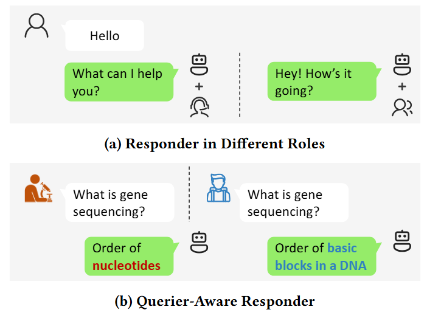

# Querier-Aware LLM: Generating Personalized Responses to the Same Query from Different Queriers

We, for the first time, study querier-aware LLM personalization to generate customized responses to the same query from different users.

<!-- > this version of code contains `finetune` and `finetune_qar` (our design)  -->

<div align="center">
      
    <figcaption>Two types of personalized language models. (a) Role-Based Responder in existing work returns answers according to the assigned personality. (b) Querier-Aware Responder in this work returns different answers for same query asked by different persons according to personality of queriers.</figcaption>
</div>

<p align="center">
       🤗 <a href="https://huggingface.co/datasets/Nidhogg-zh/Multi-Querier_Dialogue">Hugging Face</a> &nbsp&nbsp📑 <a href="https://arxiv.org/abs/2412.11736">Paper</a>&nbsp&nbsp
</p>


## 📢 News
- [2025.08] This work is accepted for publication at CIKM 2025.  
- [2024.12] We opensource Multi-Querier Dialogue Dataset.  
- [2024.12] We opensource Querier-Aware Responder.

## 📁 Key Files and Folders
- `finetune_llama.py`: training code for Llama, the default setting is lora tuning.
- `finetune_qwen.py`: training code for Qwen, the default setting is lora tuning.
- `trainer.py`: forked from transformers==4.37 with some modifications. Trainer of both Qwen and Llama. 
- `trainer_with_eval.py`: rewrite evaluation_loop function of trainer, adding evaluation with ROUGE.
- `utils.py`: some tool functions.
- `models/modeling_llama.py`: forked from transformers==4.37. Our model `LlamaForCausalLMRoleDecomposition`, `LlamaModelRoleDecomposition`, `LlamaDecoderLayerRoleDecomposition`, `LlamaMLPRoleDecompositionLowRank` are added for Questioner-Aware Personalization for English datasets. 
- `models/modeling_qwen.py`: forked from transformers==4.37. Our model `Qwen2ForCausalLMRoleDecomposition`, `Qwen2ModelRoleDecomposition`, `Qwen2DecoderLayerRoleDecomposition`, `Qwen2MLPRoleDecompositionLowRank` are added for Questioner-Aware Personalization for Chinese datasets. 
- `data`: put the datasets here (Multi-Questioner Dialogue Dataset).
- `output`: we save the results here. 
- `finetune`: config files for different datasets are put here. 

We provide configs of both vanilla finetuning (e.g. `finetune_llama_ds.sh` and `finetune_qwen_ds.sh`) and finetuning with our custom design (e.g. `finetune_llama_qar_ds.sh` and `finetune_qwen_qar_ds.sh`).

## 🚀 Quick Start

### Step 0: Install the environment
We provide a `QAR.yaml` file which includes all setting of our running environment. The python version is 3.9.18.

Set your conda path and install the environment before training. 
```sh
conda env create -f QAR.yaml
```
or Insall the necessary package with pip. 

### Step 1: Download the dataset
We construct Multi-Querier Dialogue Dataset (MQDialog) to evaluate questioner-aware personalization. The dataset can be obtained on [huggingface](https://huggingface.co/datasets/Nidhogg-zh/Multi-Querier_Dialogue). 

The following is an example of how to download the dataset using the `huggingface-cli`:
```bash
huggingface-cli download --repo-type dataset --resume-download Nidhogg-zh/Multi-Querier_Dialogue --local-dir data
```

### Step 2: Run the training scripts
We provide examples to run our code in `finetune/run_example.sh`.   

You can run the bash file with logging the output.
```sh
bash finetune/run_example.sh 2>&1 | tee output/run_example_log.txt
``` 
By default, checkpoints and evaluation results for the trained model are saved in the `output` folder.

Please refer to the script and source code for more details.

## 🛠️ Preliminary results

### Baselines
- Zero-shot: directly answer the query with the pretrained LLM.  
- FT: tune the pretrained LLM over the whole training set with the mixed dialogues between the responder and different queriers.
- RPG: concatenate the manually constructed role profile of the responder and the query together as LLM input.
- Few-shot: retrieve five dialogues from the training set as examples and concatenates them with the current query based on a template as LLM input.
- QCG: concatenates the constructed querier's characteristic prompt and the query together as the input. 

### Results with ROUGE-L scores
|	Responder	|	Zero-shot	|	FT	|	RPG	|	Few-shot	|	QCG	|	Ours	|
|	---	|	---	|	---	|	---	|	---	|	---	|	---	|
|	Sheldon	|	7.21	|	6.67	|	6.82	|	7.09	|	7.08	|	**7.40**	|
|	Leonard	|	5.49	|	7.65	|	4.75	|	5.34	|	5.44	|	**8.21**	|
|	Rachel	|	5.55	|	6.48	|	5.08	|	5.18	|	5.19	|	**7.18**	|
|	Ross	|	5.80	|	6.33	|	5.30	|	5.33	|	5.45	|	**7.06**	|
|	Claire 	|	5.21	|	5.67	|	4.83	|	5.21	|	4.78	|	**6.16**	|
|	Phil	|	6.14	|	6.22	|	4.66	|	5.07	|	4.18	|	**7.24**	|
|	Avg.	|	5.90	|	6.50	|	5.24	|	5.54	|	5.35	|	**7.21**	|
|	Tong Xiangyu	|	10.26	|	14.54	|	9.90	|	9.52	|	11.07	|	**15.50**	|
|	Bai Zhantang	|	10.57	|	14.78	|	9.74	|	8.82	|	10.51	|	**15.84**	|
|	Lv Xiucai	|	10.25	|	13.99	|	9.54	|	6.37	|	10.67	|	**14.82**	|
|	Zhen Huan	|	12.87	|	18.95	|	13.01	|	16.84	|	14.58	|	**20.18**	|
|	Emperor	|	11.58	|	16.43	|	11.54	|	14.63	|	14.60	|	**17.44**	|
|	Real Person	|	11.87	|	18.65	|	-	|	13.31	|	-	|	**19.16**	|
|	Avg.	|	11.23	|	16.22	|	10.75	|	11.58	|	12.29	|	**17.16**	|

Our method consistently outperforms all baselines. These results demonstrate that modeling both the querier’s personality and multi-querier interactions significantly enhances response quality.

## Citation
### BibTeX
Please kindly cite our paper if helps your research:

```bib
@misc{zeng2024personalizedllmgeneratingcustomized,
      title={Personalized LLM for Generating Customized Responses to the Same Query from Different Users}, 
      author={Hang Zeng and Chaoyue Niu and Fan Wu and Chengfei Lv and Guihai Chen},
      year={2024},
      eprint={2412.11736},
      archivePrefix={arXiv},
      primaryClass={cs.CL},
      url={https://arxiv.org/abs/2412.11736}, 
}
```
